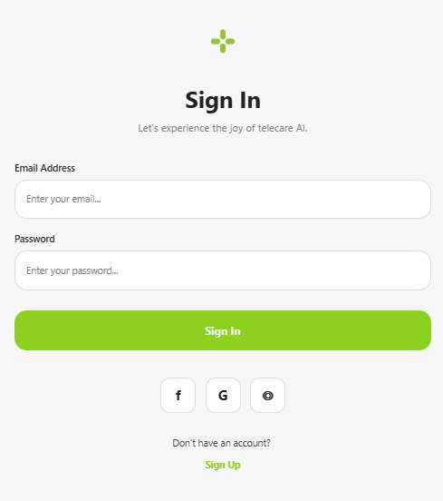

# Sign-In App

A simple sign-in application built with Expo and React Native.

## Features
- User authentication UI
- Social login buttons
- Clean and modern design

## Screenshots




## Getting Started

### Prerequisites
- [Node.js](https://nodejs.org/)
- [Expo CLI](https://docs.expo.dev/get-started/installation/)

### Installation

1. Clone the repository or download the project files.
2. Navigate to the project directory:
   ```sh
   cd sign-in-app
   ```
3. Install dependencies:
   ```sh
   npm install
   ```

### Running the Project

To start the development server, run:
```sh
npm start
```

Or, using Expo CLI:
```sh
expo start
```

This will open the Expo Dev Tools in your browser. You can then run the app on an emulator, simulator, or your physical device using the Expo Go app.

## Project Structure
- `src/app/` - App screens and layouts
- `src/components/` - Reusable UI components
- `assets/` - Images and other static assets

## License

This project is for educational purposes.
